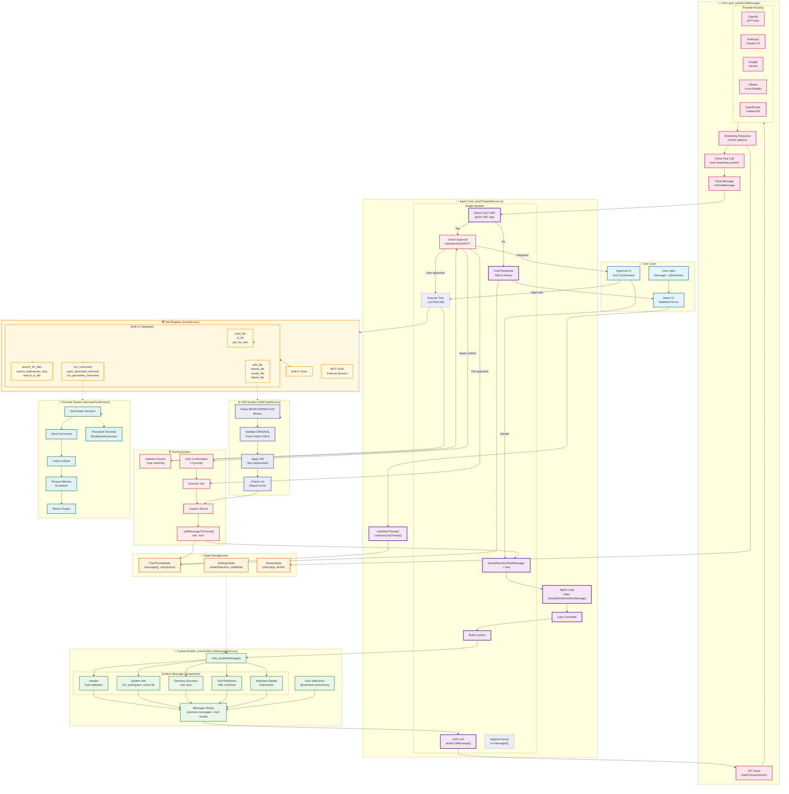
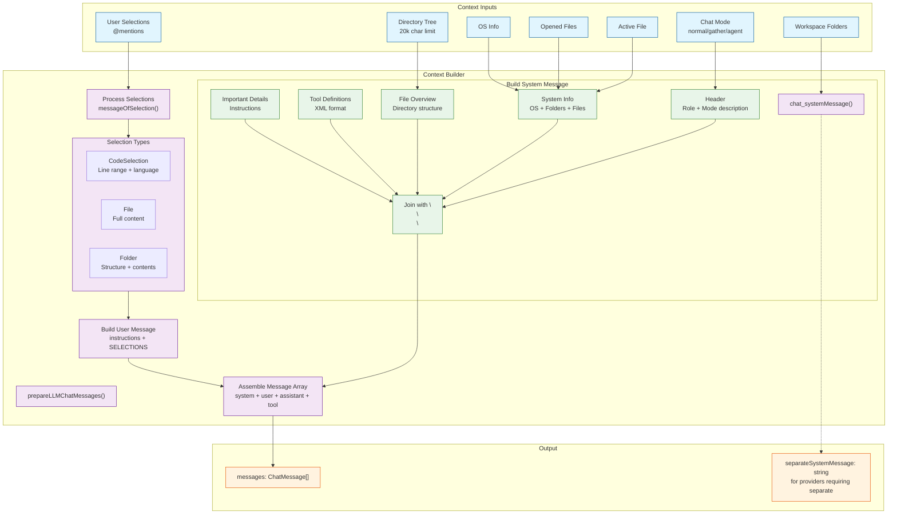
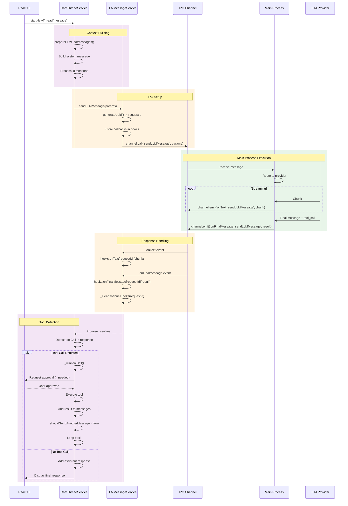
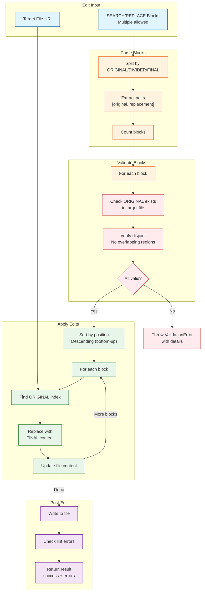
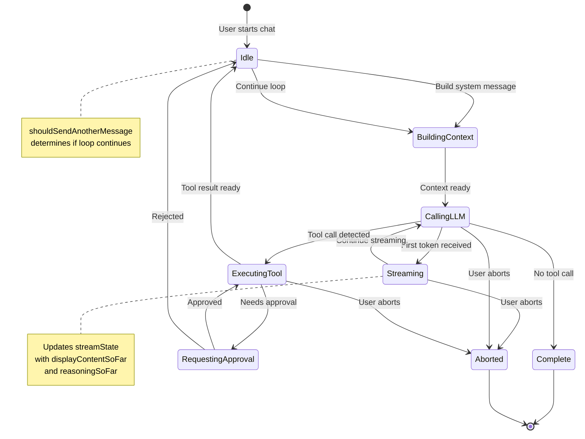

# Beam Agentic AI System - Complete Flowchart

## Full System Architecture (Mermaid)



## Detailed Agent Loop Flowchart

```mermaid
flowchart LR
    subgraph LOOP_START["Initialize"]
        INIT["nMessagesSent = 0<br/>shouldSendAnotherMessage = true<br/>isRunningWhenEnd = undefined"]
        PRE_TOOL["if (callThisToolFirst)<br/>execute pre-approved tool"]
    end

    subgraph MAIN_LOOP["Main Agent Loop"]
        CHECK_LOOP{"shouldSendAnotherMessage?"}
        RESET_FLAGS["shouldSendAnotherMessage = false<br/>isRunningWhenEnd = undefined<br/>nMessagesSent++"]

        subgraph PREPARE["Prepare Context"]
            GET_MSGS["chatMessages =<br/>allThreads[threadId].messages"]
            PREPARE_LLM["prepareLLMChatMessages<br/>system message + history"]
            CHECK_INT1{"interruptedWhenIdle?"}
        end

        subgraph LLM_RETRY["LLM Retry Loop"]
            SET_RETRY["shouldRetryLLM = true<br/>nAttempts = 0"]
            CHECK_RETRY{"shouldRetryLLM?"}
            INC_ATTEMPT["shouldRetryLLM = false<br/>nAttempts++"]

            subgraph LLM_CALL["LLM Call"]
                CREATE_PROMISE["Create promise<br/>for async completion"]
                SEND_MSG["sendLLMMessage<br/>with callbacks"]
                STREAM_CB["onText callback<br/>update streamState"]
                FINAL_CB["onFinalMessage<br/>resolve promise"]
                ERROR_CB["onError callback<br/>resolve with error"]
                ABORT_CB["onAbort callback<br/>resolve with abort"]
            end

            AWAIT_RES["await messageIsDonePromise"]
            CHECK_RUNNING{"isRunning === 'LLM'?"}

            subgraph HANDLE_RESULT["Handle LLM Result"]
                RES_TYPE{"Result Type"}

                HANDLE_ABORT["type: llmAborted<br/>setStreamState(undefined)<br/>return"]

                HANDLE_ERROR["type: llmError"]
                CHECK_RETRY_CNT{"nAttempts < CHAT_RETRIES?"]
                DO_RETRY["shouldRetryLLM = true<br/>await timeout(RETRY_DELAY)<br/>CHECK interruptedWhenIdle"]
                MAX_RETRY_ERR["Add partial response<br/>to history<br/>break"]

                HANDLE_SUCCESS["type: llmDone"]
                EXTRACT_TOOL["Extract toolCall<br/>from response"]
            end
        end

        CHECK_TOOL{"toolCall exists?"}

        subgraph EXECUTE_TOOL["Execute Tool"]
            RUN_TOOL["_runToolCall<br/>name, id, params"]
            CHECK_INT2{"interrupted?"}
            ADD_RESULT["Add tool result<br/>to messages[]"]
            SET_LOOP_CONTINUE["shouldSendAnotherMessage = true"]
        end

        NO_TOOL["No tool call<br/>Add assistant response<br/>to history"]
    end

    %% Connections
    INIT --> PRE_TOOL
    PRE_TOOL --> CHECK_LOOP

    CHECK_LOOP -->|Yes| RESET_FLAGS
    CHECK_LOOP -->|No| END["End Loop"]

    RESET_FLAGS --> GET_MSGS
    GET_MSGS --> PREPARE_LLM
    PREPARE_LLM --> CHECK_INT1

    CHECK_INT1 -->|Yes| END_EARLY["setStreamState(undefined)<br/>return"]
    CHECK_INT1 -->|No| SET_RETRY

    SET_RETRY --> CHECK_RETRY
    CHECK_RETRY -->|Yes| INC_ATTEMPT
    CHECK_RETRY -->|No| CHECK_TOOL

    INC_ATTEMPT --> CREATE_PROMISE
    CREATE_PROMISE --> SEND_MSG

    SEND_MSG --> STREAM_CB
    SEND_MSG --> FINAL_CB
    SEND_MSG --> ERROR_CB
    SEND_MSG --> ABORT_CB

    STREAM_CB --> STREAM_STATE
    STREAM_STATE -.-> UI_UPDATE["UI updates<br/>displayContentSoFar"]

    FINAL_CB --> AWAIT_RES
    ERROR_CB --> AWAIT_RES
    ABORT_CB --> AWAIT_RES

    AWAIT_RES --> CHECK_RUNNING
    CHECK_RUNNING -->|No| END_EARLY2["return"]
    CHECK_RUNNING -->|Yes| RES_TYPE

    RES_TYPE -->|llmAborted| HANDLE_ABORT
    RES_TYPE -->|llmError| HANDLE_ERROR
    RES_TYPE -->|llmDone| HANDLE_SUCCESS

    HANDLE_ABORT --> END

    HANDLE_ERROR --> CHECK_RETRY_CNT
    CHECK_RETRY_CNT -->|Yes| DO_RETRY
    CHECK_RETRY_CNT -->|No| MAX_RETRY_ERR
    MAX_RETRY_ERR --> ADD_ERR_MSG["_addMessageToThread<br/>assistant + interrupted_tool"]
    ADD_ERR_MSG --> CHECK_TOOL

    DO_RETRY --> CHECK_INT_RETRY{"interruptedWhenIdle?"}
    CHECK_INT_RETRY -->|Yes| END_EARLY
    CHECK_INT_RETRY -->|No| CHECK_RETRY

    HANDLE_SUCCESS --> EXTRACT_TOOL
    EXTRACT_TOOL --> CHECK_TOOL

    CHECK_TOOL -->|Yes| RUN_TOOL
    CHECK_TOOL -->|No| NO_TOOL

    RUN_TOOL --> CHECK_INT2
    CHECK_INT2 -->|Yes| INT_HANDLER["setStreamState(undefined)<br/>_addUserCheckpoint()"]
    CHECK_INT2 -->|No| ADD_RESULT

    INT_HANDLER --> CHECK_LOOP
    ADD_RESULT --> SET_LOOP_CONTINUE
    SET_LOOP_CONTINUE --> CHECK_LOOP

    NO_TOOL --> CHECK_LOOP

    %% Styling
    classDef start fill:#e1f5fe,stroke:#01579b
    classDef decision fill:#fff3e0,stroke:#e65100,shape:diamond
    classDef action fill:#f3e5f5,stroke:#6a1b9a
    classDef end fill:#ffebee,stroke:#b71c1c

    class INIT,PRE_TOOL start
    class CHECK_LOOP,CHECK_INT1,CHECK_RETRY,CHECK_RUNNING,RES_TYPE,CHECK_RETRY_CNT,CHECK_TOOL,CHECK_INT2,CHECK_INT_RETRY decision
    class RESET_FLAGS,GET_MSGS,PREPARE_LLM,SET_RETRY,INC_ATTEMPT,CREATE_PROMISE,SEND_MSG,AWAIT_RES,EXTRACT_TOOL,RUN_TOOL,ADD_RESULT,SET_LOOP_CONTINUE,NO_TOOL,ADD_ERR_MSG action
    class END,END_EARLY,END_EARLY2,INT_HANDLER end
```

## Context Building Flowchart



## Tool Execution Flowchart

```mermaid
flowchart LR
    subgraph CALL["Tool Call Detected"]
        PARSE["Parse XML<br/>Extract name, params"]
    end

    subgraph VALIDATE["Validation"]
        CHECK_NAME{"Valid tool<br/>name?"}
        VALIDATE_PARAMS["Validate Params<br/>Zod/schema check"]
        CHECK_TYPES{"Types valid?"}
    end

    subgraph APPROVAL["Approval Flow"]
        GET_TYPE["Get Approval Type<br/>edits/terminal/MCP/none"]
        CHECK_AUTO{"Auto-approved?"}
        SHOW_UI["Show Approval UI<br/>Button highlight"]
        WAIT_USER["Wait for user<br/>Approve/Reject"]
        CHECK_DECISION{"Approved?"}
    end

    subgraph EXEC["Execution"]
        ROUTE{"Tool Type"}

        subgraph BUILTIN["Built-in Tools"]
            READ["read_file<br/>ls_dir<br/>search_*"]
            EDIT["edit_file<br/>rewrite_file<br/>create/delete"]
            TERM["run_command<br/>persistent_terminal"]
        end

        subgraph MCP["MCP Tools"]
            MCP_CALL["MCPService.callTool<br/>serverName, toolName"]
        end
    end

    subgraph RESULT["Result Handling"]
        SUCCESS["Success"]
        ERROR["Error"]
        ADD_MSG["_addMessageToThread<br/>role: 'tool'"]
        LOOP_BACK["Continue Loop<br/>shouldSendAnotherMessage = true"]
    end

    %% Connections
    PARSE --> CHECK_NAME

    CHECK_NAME -->|No| ERR_NAME["Error: Invalid tool"]
    CHECK_NAME -->|Yes| VALIDATE_PARAMS

    VALIDATE_PARAMS --> CHECK_TYPES
    CHECK_TYPES -->|No| ERR_TYPE["Error: Invalid params"]
    CHECK_TYPES -->|Yes| GET_TYPE

    GET_TYPE --> CHECK_AUTO
    CHECK_AUTO -->|Yes| ROUTE
    CHECK_AUTO -->|No| SHOW_UI

    SHOW_UI --> WAIT_USER
    WAIT_USER --> CHECK_DECISION
    CHECK_DECISION -->|No| REJECT["Interrupted<br/>Add checkpoint"]
    CHECK_DECISION -->|Yes| ROUTE

    ROUTE -->|Context| READ
    ROUTE -->|Edit| EDIT
    ROUTE -->|Terminal| TERM
    ROUTE -->|MCP| MCP_CALL

    READ --> SUCCESS
    EDIT --> SUCCESS
    TERM --> SUCCESS
    MCP_CALL --> SUCCESS

    READ -.->|File not found| ERROR
    EDIT -.->|Parse error| ERROR
    TERM -.->|Timeout| ERROR

    SUCCESS --> ADD_MSG
    ERROR --> ADD_MSG

    ERR_NAME --> LOOP_END["End loop<br/>Show error"]
    ERR_TYPE --> LOOP_END
    REJECT --> LOOP_END

    ADD_MSG --> LOOP_BACK

    %% Styling
    classDef call fill:#e1f5fe,stroke:#01579b
    classDef validate fill:#fff3e0,stroke:#e65100
    classDef approval fill:#fce4ec,stroke:#c2185b
    classDef exec fill:#f3e5f5,stroke:#6a1b9a
    classDef result fill:#e8f5e9,stroke:#2e7d32
    classDef error fill:#ffebee,stroke:#b71c1c

    class PARSE call
    class CHECK_NAME,CHECK_TYPES,CHECK_AUTO,CHECK_DECISION,ROUTE validate
    class GET_TYPE,CHECK_AUTO,SHOW_UI,WAIT_USER approval
    class READ,EDIT,TERM,MCP_CALL exec
    class SUCCESS,ERROR,ADD_MSG,LOOP_BACK result
    class ERR_NAME,ERR_TYPE,REJECT,LOOP_END error
```

## IPC Communication Flowchart



## File Edit System Flowchart



## Key State Transitions



---

*Flowcharts represent the complete Beam Agentic AI System architecture*
