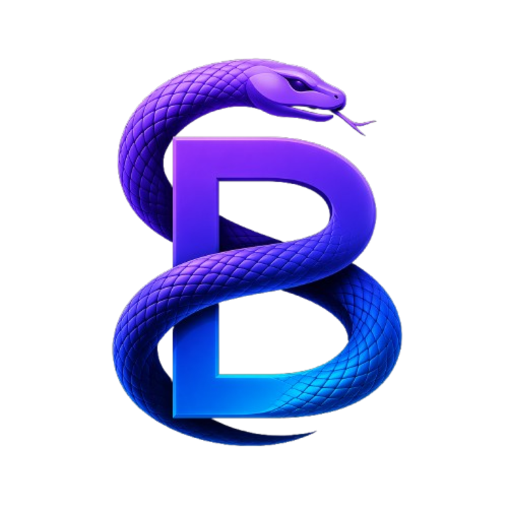

# Welcome to Beam.

	

Beam is the open-source Cursor alternative.

Use AI agents on your codebase, checkpoint and visualize changes, and bring any model or host locally. Beam sends messages directly to providers without retaining your data.

This repo contains the full sourcecode for Beam. If you're new, welcome!

- 🧭 [Website](https://github.com/devxyasir/beam)

- 👋 [Discord](https://github.com/devxyasir/beam)

- 🚙 [Project Board](https://github.com/devxyasir/beam/projects)

## Note

Beam is an actively maintained fork of the Void IDE, focused on delivering a reliable AI-native coding experience.

We welcome Issues and PRs! Reach out via [GitHub Issues](https://github.com/devxyasir/beam/issues).

## Reference

Beam is a fork of the [vscode](https://github.com/microsoft/vscode) repository. For a guide to the codebase, see [BEAM_CODEBASE_GUIDE](https://github.com/devxyasir/beam/blob/main/BEAM_CODEBASE_GUIDE.md).

For a guide on how to develop your own version of Beam, see [HOW_TO_CONTRIBUTE](https://github.com/devxyasir/beam/blob/main/HOW_TO_CONTRIBUTE.md).

## Support
You can always reach us via GitHub Issues: https://github.com/devxyasir/beam/issues.
